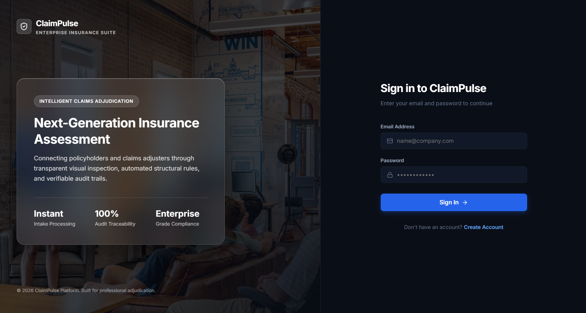
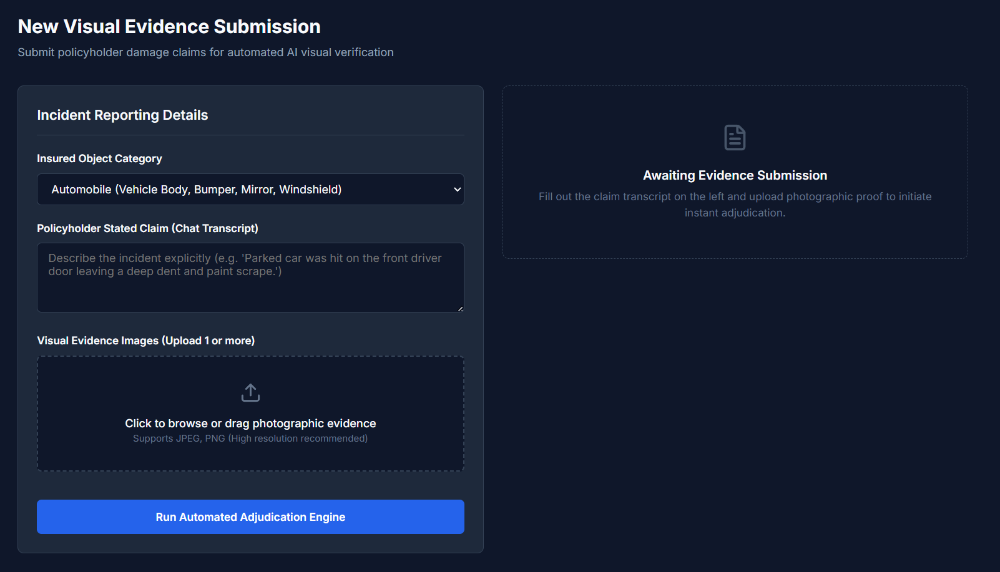
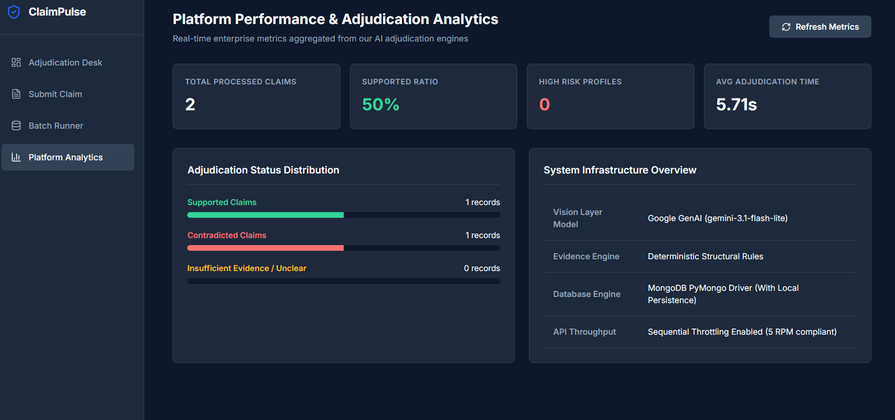
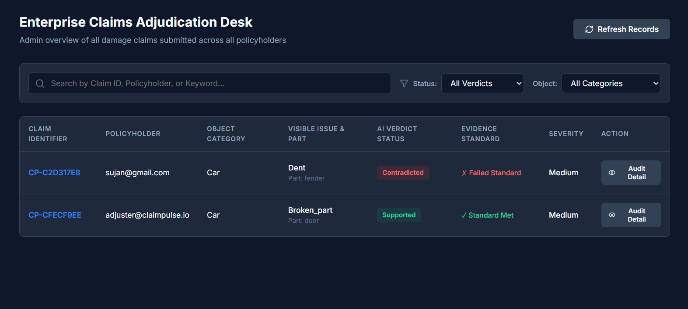
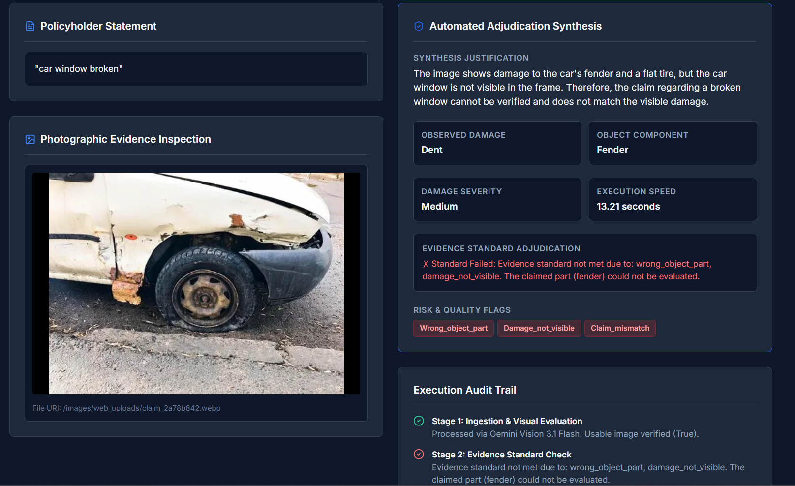
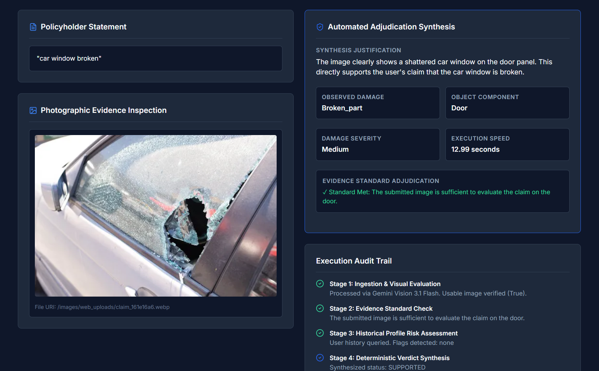

# ClaimPulse 🛡️⚡

<div align="center">

### Autonomous AI Agentic Adjudication Suite

An AI-powered platform for autonomous insurance claim verification using multimodal computer vision, deterministic evidence validation, and explainable decision synthesis.


</div>

---

# Executive Overview

Traditional insurance claim processing is slow, manual, and prone to inconsistent decisions.

ClaimPulse automates the entire claim verification pipeline using AI.

The platform combines:

- 📷 Google Gemini Multimodal Vision
- 🧠 Deterministic Evidence Validation
- 🚩 User Risk Analysis
- 📋 Explainable AI Decision Engine

Every submitted claim receives an instant verdict:

- ✅ Supported
- ❌ Contradicted
- ⚠️ Insufficient Information

along with a fully explainable audit trail.

---

# Platform Preview

## Login Portal

<p align="center">

</p>

Supports two enterprise roles:

- Policyholder
- Claims Adjuster

Features:

- JWT Authentication
- Role-Based Access Control
- Secure Login

---

## Claim Submission Portal

<p align="center">

</p>

Policyholders can

- Upload evidence
- Describe incidents
- Select asset category
- Track AI decisions instantly

Supported assets include

- Vehicles
- Electronics
- Shipping Packages

---

## Claims Dashboard

<p align="center">

</p>

Adjusters can

- View all submitted claims
- Filter by status
- Search claims
- Review AI reasoning
- Inspect uploaded evidence
- Run batch evaluations

---

## Previous Claims

<p align="center">

</p>

Users can

- Review historical claims
- Download reports
- Track verdicts

---

# Fraud Detection Example

<p align="center">

</p>

### Claim

> Vehicle suffered severe front bumper damage after a collision.

### AI Observation

- No structural deformation detected
- Claimed component mismatch
- Surface dirt only

### Verdict

```text
CONTRADICTED
```

The submitted evidence does not support the reported damage.

---

# Genuine Claim Example

<p align="center">

</p>

### Claim

> Passenger side window shattered due to vandalism.

### AI Observation

- Visible broken glass
- Correct damage location
- Medium–High severity

### Verdict

```text
SUPPORTED
```

Evidence satisfies all verification rules.

---

# System Architecture

```text
               User Submission
          (Image + Claim Description)
                     │
                     ▼
              FastAPI REST API
                     │
     ┌───────────────┼────────────────┐
     ▼               ▼                ▼

 Vision Agent   Evidence Engine   Risk Engine
 (Gemini AI)     Rule Checking   User History

     └───────────────┬────────────────┘
                     ▼

         Decision Synthesis Engine

                     │
                     ▼

        Explainable AI Verdict
```

---

# Features

- AI Image Damage Analysis
- Multimodal Vision
- Explainable AI Decisions
- Fraud Detection
- JWT Authentication
- RBAC
- MongoDB Storage
- Local JSON Backup
- Batch CSV Evaluation
- REST APIs
- Swagger Documentation
- Responsive React Dashboard

---

# Technology Stack

| Layer | Technology |
|-------|------------|
| AI | Google Gemini 3.1 Flash Lite |
| Backend | Python, FastAPI |
| Frontend | React 18, Vite |
| Database | MongoDB |
| Authentication | JWT |
| Security | Passlib Bcrypt |
| Storage | MongoDB + Local JSON |
| API | FastAPI |

---

# Folder Structure

```text
claimpulse-ai-agent/

├── api/
├── frontend/
├── dataset/
├── evaluation/

├── login.png
├── claiming.png
├── dashboard.png
├── previous_claims.png
├── example1.png
├── trueClaiming.png

├── requirements.txt
├── README.md
└── .env.example
```

---

# Installation

## Clone Repository

```bash
git clone https://github.com/sujan-vucha/claimpulse-ai-agent.git

cd claimpulse-ai-agent
```

---

## Configure Environment

```bash
cp .env.example .env
```

Example

```env
GEMINI_API_KEY=YOUR_API_KEY

JWT_SECRET=YOUR_SECRET

MONGODB_URI=mongodb://localhost:27017/claimpulse
```

---

# Run Backend

```bash
pip install -r requirements.txt

python -m uvicorn api.main:app --reload
```

Backend

```
http://localhost:8000
```

Swagger

```
http://localhost:8000/docs
```

---

# Run Frontend

```bash
cd frontend

npm install

npm run dev
```

Frontend

```
http://localhost:5173
```

---

# Demo Accounts

| Role | Email | Password |
|------|-------|----------|
| Claims Adjuster | adjuster@claimpulse.io | admin |
| Policyholder | policyholder@claimpulse.io | admin |

---

# Batch Processing

Adjusters can upload

- sample_claims.csv
- claims.csv

The platform

- Executes claims sequentially
- Respects Gemini API rate limits
- Stores results
- Generates AI verdicts
- Exports processed CSV files

---

# Decision Pipeline

Every claim passes through

1. Image Analysis
2. Evidence Validation
3. Damage Localization
4. Severity Detection
5. Risk Analysis
6. Decision Synthesis
7. Explainable AI Verdict
8. Storage

---

# REST API

| Method | Endpoint |
|---------|----------|
| POST | /login |
| POST | /register |
| POST | /claim |
| GET | /claims |
| GET | /me |
| POST | /batch |

---

# Future Enhancements

- OCR Document Verification
- VIN Verification
- GPS Validation
- Video Claims
- Human Review Workflow
- Cloud Deployment
- Email Notifications
- Mobile Application
- Analytics Dashboard

---

# License

Developed for the **Google DeepMind × HackerRank Advanced Agentic Coding Hackathon 2026**.

This project is intended for educational and demonstration purposes.
